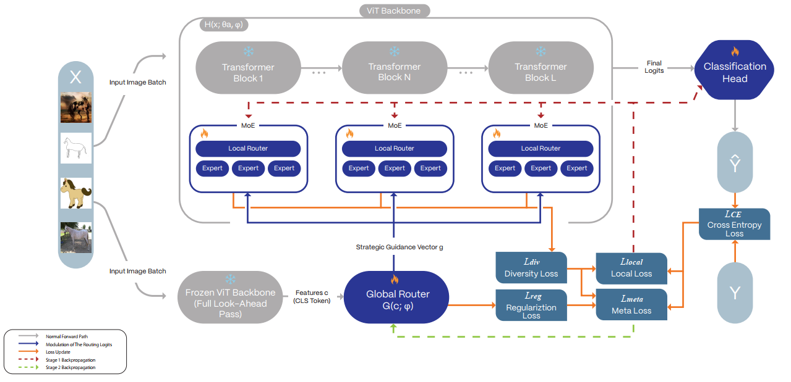
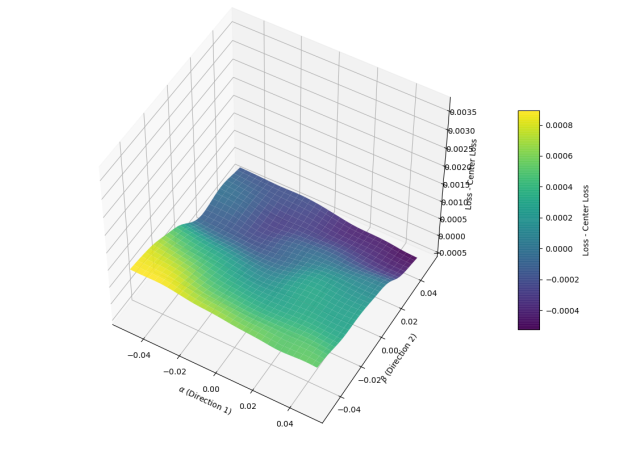
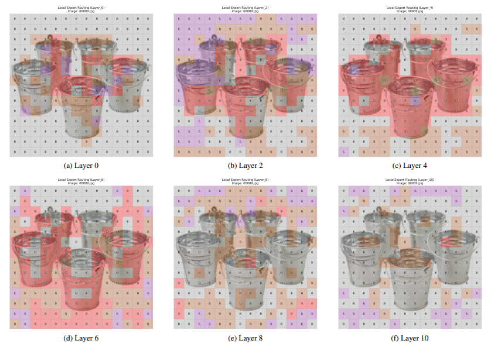
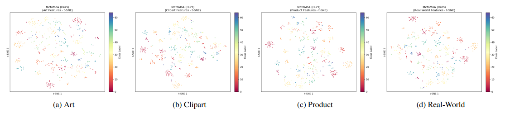
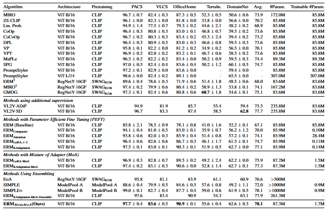

# MetaMoA: Top-Down Dynamic Guidance for Parameter-Efficient Domain Generalization

### Prerequisites 

Dataset Preparation

```bash
python -m domainbed.scripts.download --data_dir=/my/datasets/path
```

Environment Setup

```bash
conda create -n MoA python=3.9.12
conda activate MoA
pip install -r requirements.txt
```

### Training
We use [OpenCLIP ViT-B/16](https://huggingface.co/laion/CLIP-ViT-B-16-laion2B-s34B-b88K) for all experiments. The pretrained model can be loaded from timm. You can use the following command to get the model.


```bash
python train_all.py MetaMoA_full_router_reg_weight \
    --data_dir data \
    --algorithm MetaMoA \
    --dataset OfficeHome \
    --model nf_vitbase_moek_every_qkv_new \
    --seed 1 \
    --steps 10000 \
    --l_aux \
    --use_router_reg True \
    --router_reg_weight 0.2 \
    --meta_lr 1e-5 \
    --meta_update_freq 1 \
    --diversity_weight 0.01 \
    --router_type mlp \
    --hidden_dim 256 \
```

<p align="center">
    
</p>

Figure 1. An overview of the MetaMoA framework and its training procedure. An input image batch follows two parallel paths. First, in a
”look-ahead” pass, it traverses a frozen ViT backbone to extract a holistic feature vector (The [CLS] token), which is then fed to the Global
Router. This meta-controller produces a Strategic Guidance Vector g. Second, the same input batch is processed by the main ViT, which
contains trainable Mixture-of-Adapters (MoA) adapters. At each layer, the local router’s decision is modulated by the strategic guidance
vector. The final logits are used to compute the loss. Training proceeds in two alternating stages: Stage 1 (red dashes) updates the local
adapters and classifier parameters based on Llocal. Stage 2 (green dashes) updates the Global Router’s parameters based on Lmeta. Optional
diversity and regularization losses are also shown.
<p align="center">
    
</p>

Figure 2. Visualization of the loss landscape for the local
adapter parameters (θa) on an unseen target domain. The
plot shows a 2D cross-section of the high-dimensional loss surface around the final parameters found by MetaMoA (located at
the center, α = 0, β = 0). The surface is rendered using cubic
interpolation and a Gaussian filter from a grid of sampled loss values. The wide, relatively flat basin demonstrates that the solution
is robust and not located in a sharp, narrow minimum, which is a
strong indicator of good generalization performance
<p align="center">
    
</p>

Figure 3. Visualization of local expert routing decisions across different ViT layers for a sample image from the OfficeHome dataset.
Each square corresponds to an image patch (token), and the number and color indicate which of the four experts (0-3) was selected by
the local router at that position. A clear pattern of specialization emerges through the network’s depth. In the middle layers (d, e), Expert
0 (red) learns to act as a powerful foreground segmenter, almost perfectly isolating the buckets from the background, which is primarily
handled by Expert 3 (grey). In later layers (f), the routing becomes more diverse as the model processes higher-level abstract features. This
demonstrates that our MoE adapters are learning semantically meaningful, specialized functions.
<p align="center">
    
</p>

Figure 4. t-SNE Visualization of MetaMoA Feature Embeddings on OfficeHome Target Domains. We project the 768-dimensional
feature representations learned by our MetaMoA model into a 2D space using t-SNE. Each point corresponds to an image from a held-out
test domain and is colored by its ground-truth class label. The clear formation of semantically meaningful clusters across all four distinct
domains—(a) Art, (b) Clipart, (c) Product, and (d) Real-World—demonstrates that our method learns highly separable features, which is a
key indicator of strong generalization performance.


### Results

<p align="center">
    
</p>


Table 1. Comparison of different domain generalization methods on five standard benchmarks. All methods use a ViT-B/16 backbone
pre-trained with CLIP unless specified otherwise. #Param. denotes total parameters, while Trainable #Param. refers to parameters updated
during training. Our method, ERMMeta MoA, achieves competitive or superior performance while remaining highly parameter-efficient.
Best PEFT results are bolded.

### Acknowledgements

This code is heavily based on [MoA](https://github.com/cvlab-kaist/MoA), [MIRO](https://github.com/kakaobrain/miro), [SWAD](https://github.com/khanrc/swad) and [DomainBed](https://github.com/facebookresearch/DomainBed). Also, the LoRA implementation is based on [LoRA](https://github.com/cloneofsimo/LoRA). We also used the official implementation of [KAdaptation](https://github.com/eric-ai-lab/PEViT), and the [Cosine Router](https://arxiv.org/abs/2206.04046) using [this](https://github.com/Luodian/Generalizable-Mixture-of-Experts) github. We highly appreciate the authors for their great work.

### Citation
If you found this code useful, please consider citing our paper.

